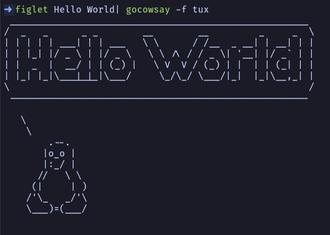

# GoCowsay

CLI-Tool creada en Go

### Preview
**Fortune Cow**

**Figlet Tux**


## Instalacion
Clona el repositorio en tu sistema y realiza un go build para añadirlo a tu sistema.
```
git clone https://github.com/juxnillo/gocowsay.git
cd gocowsay
go build
```

### Ejecucion

Puedes añadirle fortune o figlet al principio para el texto.

```
figlet Hello World! | gocowsay 
```
Puedes cambiar el animal usando la flag -f

```
gocowsay -f tux Hello World!
```
La lista de animales disponibles es:
- cow
- stegosaurus
- tux
- kitten
- whale
